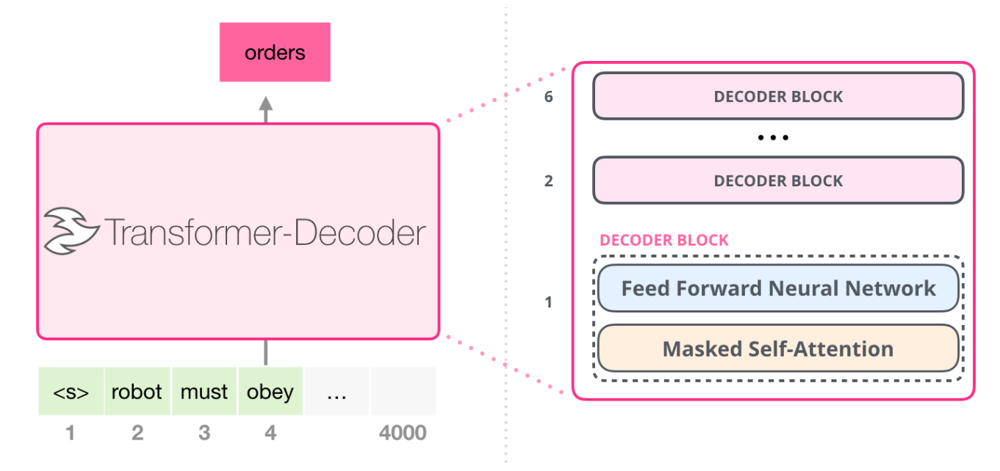

# ECE408 Final Project - GPT-2

## Table of Contents

 - [GPT-2](#gpt-2)
 - [Notes on Teamwork](#notes-on-teamwork)
 - [Project Details](#project-details)
 - [Project Overview](#project-overview)
 - [Talk to the GPT2 You Wrote!](#talk-to-the-gpt2-you-wrote)
 - [Milestone Deadlines](#milestone-deadlines)
 - [Demos](#demos)
 - [Grading Rubric](#grading-rubric)
 - [Final Notes](#final-notes)
 - [License and Academic Integrity Information](#license-and-academic-integrity-information)

## GPT-2

[GPT-2](https://github.com/openai/gpt-2) (Generative Pretrained Transformer 2) is a transformer-based language model developed by OpenAI, released in 2019. GPT-2 is based on the Transformer architecture, which was first introduced in the paper [Attention is All You Need](https://arxiv.org/pdf/1706.03762). It is one of the first large-scale models to showcase the power of unsupervised learning for natural language generation tasks. GPT-2 is one of the works that marked the point of scaling law, where scale (i.e., model size, data size, and computational resources) was identified as a critical factor in performance. In addition, GPT-2 is part of a lineage of models that leverages transformer architecture, focusing on autoregressive generation, meaning it predicts the next word in a sequence given all the previous words using a decoder-only architecture. This paradigm has proved to be scalable and was adopted in later widely used works including ChatGPT. Therefore, hardware optimization and acceleration based on GPT-2 or other decoder-only transformers has become a crucial topic in parallel programming application. 

Because of the significance of GPT-2 and its relatively manageable model size, you are tasked with using CUDA to accelerate GPT-2's inference (forward pass) performance.

### Industry Relevance
The traditional ECE 408 project has been the CNN project, which is still fundamental to computer vision. However, the industry has shifted aggressively towards transformers, which is the architecture behind LLMs such as ChatGPT, Claude, and Gemini. This project was created in part to bridge this gap. The concepts and technical skills (kernel optimization) you learn through this project have extremely high relevance to the current state of the industry.

While the project may seem daunting in terms of the workload, with a capable team of 4 members, the workload is roughly comparable to the CNN Project.

## Notes on Teamwork

In this project, you and your teammates will work, present, and be graded as a team. This means that all members share responsibility for the final outcome and are expected to contribute meaningfully to the project. It is essential that you always actively communicate with each other about your individual progress, challenges, and plans for the project. This is especially important given the required milestone demo meetings, as every group member can affect your grade. As your grade is based on the work of other members of your team, please be fully confident in who you are choosing to work with. 

## Project Details

This project is designed to be a team-based, multi-milestone project spanning the remainder of the semester. You need to form a team of 3-4 students (enrolled in the course) to work on this project. Each team will be assigned a course staff member as their mentor/grader for the project. We recommend having a team of 4 students if possible, as this project is quite large in scope, and the workload for each student is significant. Teams with fewer than 3 or more than 4 students will not be allowed. We recommend you use Campuswire or [Discord](https://discord.gg/X2GnMTXHEW) to find a team, however you can also sign up through the form on Campuswire without a team and we will attempt to match you.

In this Project, you and your team will implement the entire forward pass (inference) of GPT-2 using CUDA, perform various optimizations, and thoroughly analyze the performance of your implementation using Nvidia profiling tools. Inference in this case means we will provide you a pre-trained model of GPT-2, and you implementation must solely generate new responses. In the last milestone, you will also have the chance to explore a few additional optimizations of your choice and further improve the performance of your implementation. 

**Note**: The Grace Period Policy for assignment submissions applies to the GPT Final Project as well.

### GPT-2 Architecture
Below is a brief introduction to the overall architecture of GPT-2. If you already have a good understanding of the Transformer architecture, feel free to skim through the below sections or simply skip ahead to the other sections. Otherwise, we recommend gaining a clear understanding of the algorithms used in the GPT-2 architecture. Although we don't expect you to understand 100% of the details (ECE 408 is not an AI/ML course), you should understand the core concepts and goals of each component, as it will certainly help you with many aspects of this project. We also highly recommend [3Blue1Brown's Youtube Series on Transformers](https://www.youtube.com/watch?v=wjZofJX0v4M&list=PLZHQObOWTQDNU6R1_67000Dx_ZCJB-3pi&index=6) for a more visual explanation of the Transformer architecture.

#### Transformer Decoder Architecture
Similar to [Transformer-Decoder](https://arxiv.org/abs/1801.10198) as shown in Figure below , GPT-2 is composed of stacked transformer decoder layers. Each decoder block contains Multi-Head Self-Attention, Feed-Forward Network (FFN), Layer Normalization and Residual Connections. GPT-2's full model consists of 48 transformer layers (blocks) for the 1.5 billion parameter version. 

#### Multi-Head Self-Attention Mechanism
GPT-2 uses Multi-Head self-attention to attend to all previous tokens in the sequence to predict the next token. The model processes the input sequence and computes attention scores for each token, based on its relationships with the other tokens in the sequence. In multi-head self-attention, we perform the self-attention mechanism `h` times, where each head learns its own set of WQ(h), WK(h), and WV(h) weight matrices.

For each head `h`, the attention is computed independently:

head_h = softmax(Qh * Kh T / sqrt(dk)) * Vh

Where:
- Qh = X * WQ(h)
- Kh = X * WK(h)
- Vh = X * WV(h)

After computing attention for all heads, the outputs of each head are concatenated:

MultiHead(Q, K, V) = Concat(head1, head2, ..., headh) * WO

#### Causal Masking
GPT-2 uses causal masking in its self-attention mechanism. This ensures that when predicting the next token, the model only attends to the tokens that have come before it and does not look ahead. This masking enforces the autoregressive property, allowing GPT-2 to predict the next word in sequence rather than processing all tokens simultaneously. Pay attention to this in the softmax implementation. Note that the way we implement causal masking is different than the way presented in the 3Blue1Brown video. Take a look at `softmax_forward_cpu` inside of `cpu_kernels/attention.cuh`, and see if you can spot the difference.

#### Feed-Forward Network (FFN) 
After the self-attention operation, the output is passed through a feed-forward network, consisting of two linear transformations (Matrix Multiplication) with a GeLU activation in between. A GeLU activation is just a smooth version of ReLU that is differentiable (great for an activation function). It introduces non-linearity and can capture complex patterns.

#### Layer Normalization and Residual Connections
Like other transformer-based models, GPT-2 uses residual connections and layer normalization to stabilize and improve the learning process. Like the name suggests, layer normalization normalizes across the feature dimension for each token. Furthermore, residual connections help propagate results of all layers to the final output.

#### Encoder
GPT-2 uses a decoder-only architecture. It does not have a learnable encoder network model. But you might ask: Why is there an "encoder" kernel in this project? The answer is that here the "encoder" kernel is simply used to convert the input tokens into their corresponding embeddings, which are then fed into the transformer layers. 

## Project Overview

To be able to pull code from the release repository, add it using the following command:

      git remote add gpt_release https://github.com/illinois-ece408/sp26_ece408_.gpt-release.git

   You can run `git remote -v` to verify that the repository was added. Then, you can fetch code for each milestone released using the following commands:
   
      git fetch gpt_release

      git merge gpt_release/main -m "funny comment" --allow-unrelated-histories
   
   If you see a merge conflict at this step, you may manually resolve the conflict or have Git accept all upstream changes. Make sure you have all contents of the milestone release (especially this README file) in your repository before proceeding. Then you may push the changes to your team's repository using:

      git push origin main

For this project, you will only need to write and optimize the forward pass CUDA kernels in the `kernels` folder. 

For each kernel, you need to implement each of the functions marked with `// Implement this`. We have provided non-parallel reference implementations for each of the kernels using CPU in the `cpu_kernels` folder. These reference implementations do not make use of the GPU. Your job is to utilize your parallel programming knowledge to rewrite (and improve upon) the kernels so that they take full advantage of the parallelism available on GPUs. 

Below is a brief overview of the main kernels that you'll be working with in this project:

 - `encoder_forward`: Converts the model's input tokens into a compact, meaningful representation for the processing in the model's forward pass.
 - `layernorm_forward`: Stabilizes the outputs of the model. This step is crucial for maintaining consistent behavior in the model.
 - `matmul_forward`: Performs matrix multiplication to transform inputs using learned weights.
 - `attention_forward`: Assigns dynamic weights to different parts of the input, allowing the model to focus on relevant information for better understanding.
 - `residual_forward`: Helps to preserve information from previous layers while adding new information from subsequent layers.
 - `gelu_forward`: Introduces non-linearity into the model, allowing it to capture more complex patterns.

**Note:** You are expected to adhere to University of Illinois academic integrity standards. Do not attempt to subvert any of the performance-measurement aspects of the final project. If you are unsure about whether something does not meet those guidelines, ask a member of the GPT Project course staff.

## Talk to the GPT2 You Wrote!

Once you have implemented the forward pass correctly, you will be able to talk* to the GPT-2 model you wrote! You can input text into the model and have it complete the text for you. To do this, run the command

    make next_token_generation

Then, go into `generate_tokens.slurm` and edit the text you want the model to complete. After that, run

    sbatch generate_tokens.slurm
   
Once the job has completed, you can then find the model outputs in `generate_tokens_output.out`!

*\*talk: voice recognition not included, and no fancy chatbot capabilities, but by inputting text and having the model complete it, you can still technically talk to the GPT-2 model you wrote!*

## Milestone Deadlines

All deliverables are due at **11:59 PM US Central Time** on the due date for each Milestone. 

| Milestone   | Due                         |
| ----------- | ----------------------      |
| Milestone 1 | March 6th                         |
| Milestone 2 | April 10th                         |
| Milestone 3 | May 1st                         |

**Note**: The 3-day grace period policy applies to the GPT Project milestones as well. However, the grace period does NOT apply to the demo dates. This means that you still have to sign up and attend the demo on the scheduled date even if you are using the grace period for that milestone for your other deliverables (e.g. code and/or report).

## Demos

As part of this project, all team members are required to attend a demo meeting after every milestone is due. At a demo, you are required to answer questions regarding each milestone to demonstrate your understanding of the milestone contents. Each member is responsible for all the topics covered in the milestone, and questions will be asked individually without help from other team members. We also reserve the right to ask additional questions regarding code that you have written, in which case the team can answer together. Each demo will last approximately 15-20 minutes. 

Demo questions are conceptual, which means you will need to understand why each kernel/optimization is written a specific way and how they all work together. The demo questions will involve little to no calculations. Make sure you are familiar with **all parts** of the milestone before the demo. Each team member's demo grade will depend on both the correctness of their own answer, as well as their teammates' answers. 70% of your demo grade will be the individual component, and 30% will be from the team component. **In other words, to receive full credit for a demo, every member needs to correctly answer their question.** *Partial credit will be given if you answered your demo question correctly, but one or more of your teammates did not.* (If you answered your question incorrectly, you will receive a zero for your demo grade in that milestone)

Demos will always take place on the Monday after each milestone deadline. Each team will need to sign up for one demo slot using a Google Sheet, which we will release closer to the demo date. If any member(s) of the team cannot attend the demo on the scheduled date for any reason, please reach out to GPT Project course staff as soon as possible.

### Demo Schedule and Location

- Milestone 1 Demo: March 9th
- Milestone 2 Demo: April 13th
- Milestone 3 Demo: May 4th

All demos are in-person at the **NCSA**. Please show up on time for the demo slot you signed up for and do not congregate and/or make loud conversations outside the room as there are NCSA staff offices around. 

*Also make sure to arrive early for your first demo, you may find it difficult to locate the demo room if you're not already familiar with the NCSA building layout.*

## Grading Rubric

1. Milestone 1 ( 15% )
   - Baseline Implementation Correctness ( 10% )
   - M1 Demo ( 5% )
2. Milestone 2 ( 30% )
   - M2 Required Optimizations Correctness ( 18% )
   - Profiling Report and Optimization Proposal ( 7% )
   - M2 Demo ( 5% )
3. Milestone 3 ( 50% )
   - M3 Required Optimizations Correctness ( 20% )
   - Additional Optimizations Code Correctness ( 10% )
   - Final Report ( 15% )
   - M3 Demo ( 5% )
4. Subjective Evaluation ( 5% )
5. Extra Credit ( capped up to 10% )
   - Optimizations Beyond M3 Requirements ( see [M3_README.md](M3_README.md) )
   - Competition Leaderboard Placement ( TBD )

**Note on Code Deliverables:** You and your teammates are fully responsible for ensuring that your code is ready and submitted on time. This means that any last-minute bugs in code submitted to the main branch will be counted against your team's grade, with compilation errors resulting in a 0 for your whole team's code grade in that milestone.

### Code Style/Clarity Point Deduction
Please note that as a student in a 400-level technical course, you are expected to write code that is clear and easy to read, or comment your code for any potentially confusing sections. Course staff reserve the right to deduct your team's Subjective Evaluation points if your code is deemed unusually difficult to read. 

We expect to *NOT* deduct code style/clarity points for most (hopefully all) groups in this project, but we want to make sure you are aware of this policy and that you are writing code with good variable names and comments.

## Final Notes

Please understand that this is a new project recently introduced to ECE 408. We are actively working on improving the project and your feedback is crucial for us to make this project better! We appreciate your initiative on participating on this new project, please do not hesitate to reach out to us if you have any questions or spot any errors in our code/instructions. 

While this project can seem overwhelming at times, we truly hope that you will find it rewarding and fun!

We are excited to hear from you soon, good luck!

## License and Academic Integrity Information

You are **NOT** allowed to share any part of the ECE 408 GPT Final Project to anyone outside of your team. This includes, but is not limited to, sharing/publishing online the project description, code, and any other project-related materials.

The ECE 408 GPT Final Project is based on [llm.c](https://github.com/karpathy/llm.c?tab=readme-ov-file#llmc), an open-source project led by ex-OpenAI research scientist Andrej Karpathy. The original project is licensed under the MIT License. 

Although you are free to explore llm.c (and we encourage you to do so if you would like to benchmark your work against it), please note that you are **NOT** allowed to copy any part of the llm.c project into your submission without proper citation and permission from the course staff.

As this project is part of the coursework at UIUC, it is essential to adhere to the University's academic integrity policies. Please refrain from using any external sources, repositories, or unauthorized online materials to complete your work. 

AI usage should be limited for your own benefit, as modern LLMs often struggle with the specifics of parallel programming and CUDA, and tends to introduce nasty bugs. It is ok to use AI to assist with writing comments, improving code readability, and other non-core programming tasks. However, any non-trivial usage of AI tools must be properly cited, and you must be prepared to answer questions regarding your code. 

Violations of academic integrity, including plagiarism or unauthorized collaboration with members outside of your team, will be taken seriously and may result in disciplinary actions, including but not limited to a grade of zero for the project and reporting to the University.

Please refer to the [University of Illinois Academic Integrity Policy](https://studentcode.illinois.edu/) for more details.

### More Information on Software Licenses

Software licenses play an important role in protecting intellectual property while enabling collaboration in the software development community. It is essential to understand the implications of different licenses when it comes to sharing, modifying, and distributing software. 

#### Some common types of software licenses include:

**MIT License**: One of the most permissive licenses, requiring only attribution while allowing commercial use. It's particularly popular in educational projects and small open-source tools.

**GNU GPL License**: Takes a stronger stance on software freedom. It enforces "copyleft" principles, requiring that any derivative works must also be open source. This license has been fundamental to the growth of Linux and many other major open-source projects.

**Apache License 2.0**: Provides a middle ground, offering similar permissions to MIT while also including explicit patent rights. This makes it particularly suitable for corporate use and large-scale projects.

Authors can also choose to reserve all rights to their software, making it proprietary and closed-source. 